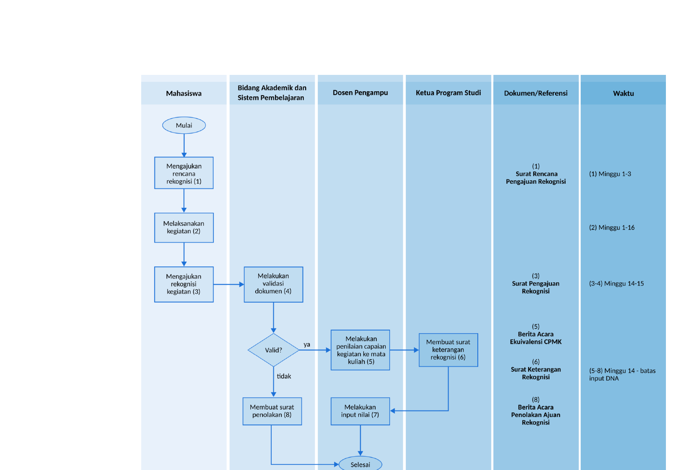

# Panduan Rekognisi Kegiatan Mahasiswa S1 TRM

## Bab 1 Pendahuluan

### 1.1. Latar Belakang

Di era digital dan revolusi industri 4.0, dunia pendidikan tinggi dituntut menghasilkan lulusan yang tidak hanya memiliki kompetensi akademik tetapi juga kemampuan praktis yang relevan dengan kebutuhan industri dan masyarakat. Program Studi Sarjana Terapan Teknologi Rekayasa Multimedia berkomitmen mendukung pengembangan kompetensi mahasiswa melalui berbagai kegiatan di luar program studi, seperti praktik kerja industri, proyek independen, penelitian, kewirausahaan, dan kegiatan sosial.

Kebijakan Merdeka Belajar Kampus Merdeka (MBKM) yang dicanangkan Kementerian Pendidikan, Kebudayaan, Riset, dan Teknologi memberikan kesempatan bagi mahasiswa belajar di luar program studi selama maksimal tiga semester. Hal ini memungkinkan mahasiswa memperoleh pengalaman belajar yang lebih luas dan kontekstual. Akan tetapi, untuk memastikan kegiatan tersebut sejalan dengan capaian pembelajaran lulusan (CPL) program studi, diperlukan panduan ekuivalensi yang jelas dan terukur.

### 1.2. Dasar Hukum

#### 1.2.1. Nasional

Penyusunan panduan ekuivalensi kegiatan mahasiswa ini didasarkan peraturan perundang-undangan yang berlaku, antara lain sebagai berikut.

1. Peraturan Menteri Pendidikan dan Kebudayaan Republik Indonesia Nomor 3 Tahun 2020 tentang Standar Nasional Pendidikan Tinggi, yang memberikan hak kepada mahasiswa belajar di luar program studi selama maksimal tiga semester.
2. Keputusan Menteri Pendidikan dan Kebudayaan Republik Indonesia Nomor 74/P/2021 tentang Pengakuan Satuan Kredit Semester Pembelajaran Program Kampus Merdeka, yang mengatur pengakuan SKS atas kegiatan pembelajaran di luar program studi.
3. Peraturan Menteri Pendidikan, Kebudayaan, Riset, dan Teknologi Republik Indonesia Nomor 63 Tahun 2024 tentang Penyelenggaraan Magang Mahasiswa, yang memberikan pedoman pelaksanaan magang sebagai bagian dari kegiatan pembelajaran di luar program studi.

#### 1.2.2. Perguruan Tinggi

Universitas Telkom memiliki dasar peraturan dalam memberikan fasilitas kepada mahasiswa untuk melaksanakan kegiatan di luar program studi, di antaranya:

1. Panduan Merdeka Belajar Kampus Merdeka (MBKM) tahun 2023 Universitas Telkom.
2. Surat Keputusan Dekan No.KD041/AKD06/IT-DEK/2023 tentang rekognisi MBKM: Skenario dan ekuivalensi SKS di Fakultas Ilmu Terapan.

### 1.3. Tujuan

Panduan ekuivalensi ini bertujuan untuk:

1. Memberikan pedoman bagi mahasiswa dalam mengajukan pengakuan kegiatan di luar program studi yang relevan dengan CPL Program Studi Sarjana Terapan Teknologi Rekayasa Multimedia.
2. Membantu dosen pembimbing akademik dan tim asesor dalam menilai dan menyetarakan kegiatan mahasiswa dengan mata kuliah yang sesuai dalam kurikulum.
3. Menjamin kegiatan di luar program studi yang diakui memiliki kualitas dan relevansi setara dengan pembelajaran di dalam program studi.

### 1.4. Manfaat

Manfaat penerapan panduan ekuivalensi ini meliputi:

1. Meningkatkan fleksibilitas dan keberagaman pengalaman belajar mahasiswa.
2. Mendorong mahasiswa aktif terlibat dalam kegiatan yang mendukung pengembangan kompetensi profesional dan sosial.
3. Memperkuat hubungan dunia akademik dan industri melalui pengakuan terhadap pengalaman praktis mahasiswa.
4. Memastikan kegiatan di luar program studi berkontribusi secara signifikan terhadap pencapaian CPL program studi.

### 1.5. Batasan

Panduan ekuivalensi ini memiliki batasan sebagai berikut.

1. Hanya berlaku untuk kegiatan mahasiswa yang dilakukan di luar program studi namun masih dalam lingkup pendidikan tinggi, seperti praktik kerja industri, penelitian, proyek independen, kewirausahaan, dan kegiatan sosial yang relevan.
2. Kegiatan yang diajukan, harus memiliki dokumentasi lengkap dan dapat diverifikasi, termasuk laporan kegiatan, sertifikat, atau bukti lainnya.
3. Proses ekuivalensi dilakukan berdasarkan kesesuaian kegiatan yang dilakukan dan Capaian Pembelajaran Mata Kuliah dalam kurikulum program studi.
4. Panduan ini tidak mencakup kegiatan yang tidak memiliki relevansi dengan CPL Program Studi Sarjana Terapan Teknologi Rekayasa Multimedia.

---

## Bab 2 Landasan Ekuivalensi

### 2.1. Pengertian Ekivalensi

Ekuivalensi kegiatan adalah proses penyetaraan kegiatan pembelajaran mahasiswa di luar program studi formal dengan capaian pembelajaran yang telah ditentukan dalam kurikulum program studi. Proses ini dilakukan dengan menilai kesesuaian output, proses, dan kompetensi yang dihasilkan suatu kegiatan terhadap Capaian Pembelajaran Lulusan (CPL) dan Capaian Pembelajaran Mata Kuliah (CPMK) dalam kurikulum yang berlaku.

Ekuivalensi tidak hanya bersifat administratif tetapi juga bertujuan menjamin pengalaman belajar mahasiswa melalui jalur non-konvensional memiliki nilai akademik dan kontribusi nyata terhadap pengembangan kompetensi.

### 2.2. Prinsip Ekivalensi

Dalam pelaksanaan ekuivalensi terdapat prinsip-prinsip dasar yang menjadi pedoman, yaitu:

1. **Relevansi:** Kegiatan harus memiliki hubungan yang jelas dan logis dengan bidang keilmuan dan CPL program studi.
2. **Keterukuran:** Hasil kegiatan harus dapat dinilai secara objektif berdasarkan indikator yang terukur.
3. **Keadilan:** Proses asesmen dilakukan secara adil dan tidak diskriminatif terhadap jenis kegiatan atau konteks pelaksanaannya.
4. **Transparansi:** Prosedur dan kriteria ekuivalensi disusun secara terbuka agar mudah dipahami seluruh pihak terkait.
5. **Akuntabilitas:** Setiap keputusan ekivalensi harus dapat dipertanggungjawabkan secara akademik dan administratif.

### 2.3. Batasan Kegiatan dan Ekivalensi

Setiap kegiatan harus disertai dokumentasi lengkap yang digunakan sebagai dasar penilaian. Jenis kegiatan yang dapat diajukan untuk proses ekuivalensi meliputi:

#### 1. Praktik Kerja Industri

Praktik kerja industri adalah kegiatan pembelajaran di dunia kerja (industri, perusahaan, lembaga pemerintahan, atau organisasi lain) yang dilakukan dalam jangka waktu tertentu. Mahasiswa terlibat secara langsung dalam proses kerja profesional, baik sebagai anggota tim maupun individu.

Jenis kegiatan yang dapat direkognisi adalah kegiatan yang sudah terdaftar dalam program rekognisi dari penyelenggara, di antaranya magang bersertifikat (MBKM), magang dua semester, magang ekstensi, Kuliah Kerja Nyata (KKN) Tematik, dan kegiatan serupa yang bersifat pembelajaran di dunia kerja. Jenis kegiatan ini hanya bisa diajukan mahasiswa tingkat 4 (empat) dan mengekuivalensi mata kuliah paket di semester aktif.

#### 2. Studi Independen

Studi independen adalah proses belajar di luar kampus yang menerapkan pembelajaran terstruktur maupun non-struktur dari mentor yang berpengalaman di perusahaan. Kegiatan pembelajaran yang diikuti harus sesuai Capaian Pembelajaran Lulusan di program studi dan memiliki rencana, tujuan, dan waktu yang jelas.

Beberapa jenis kegiatan yang dapat diikuti dari program Studi Independen Bersertifikat (SIB) MBKM adalah Bangkit Academy, Dicoding Academy, dan Skilvul. Sedangkan contoh program Non-SIB diantaranya Coursera, Udemy, dan jenis kegiatan lain yang serupa dan bersifat pembelajaran reguler secara mandiri. Jenis kegiatan ini diajukan mahasiswa tingkat 3 (tiga) dan mengekuivalensi mata kuliah paket di semester aktif.

#### 3. Penelitian atau Pengembangan Ilmiah

Penelitian atau pengembangan ilmiah adalah kegiatan yang berorientasi pada pencarian solusi berbasis metode ilmiah terhadap suatu permasalahan yang relevan dengan bidang teknologi multimedia interaktif. Jenis penelitian atau pengembangan ilmiah yang dilakukan harus berkolaborasi dengan industri atau masyarakat dan memiliki rencana, tujuan, dan waktu yang jelas.

Beberapa jenis kegiatan yang dapat diikuti adalah Kedaireka (Kemitraan Dunia Usaha dan Kreasi Reka), PKM (Program Kreativitas Mahasiswa), dan jenis kegiatan lain yang serupa dan bersifat Problem Based Solving. Jenis kegiatan ini diajukan mahasiswa tingkat 3 (tiga) atau 4 (empat) dan mengekuivalensi mata kuliah paket di semester aktif.

#### 4. Kegiatan Organisasi dan Sosial Kemasyarakatan

Kegiatan organisasi dan sosial kemasyarakatan adalah aktivitas kemahasiswaan yang mengembangkan keterampilan kepemimpinan, manajemen, komunikasi, serta tanggung jawab sosial. Jenis kegiatan yang dilakukan harus berkolaborasi dengan komunitas kemasyarakatan dan memiliki dampak langsung terhadap lingkungan sosial.

Beberapa jenis kegiatan yang dapat diikuti adalah POMN (Program Ormawa Membangun Negeri), P2MD (Program Pemberdayaan Masyarakat Desa), dan jenis kegiatan lain yang serupa dan bersifat pembelajaran dengan layanan kepada masyarakat. Jenis kegiatan ini diajukan mahasiswa tingkat 3 (tiga) atau 4 (empat) dan mengekuivalensi mata kuliah paket di semester aktif.

#### 5. Pertukaran Pelajar atau Studi di Luar Prodi

Pada pertukaran pelajar atau studi di luar prodi, mahasiswa mengikuti program akademik di perguruan tinggi lain, baik di dalam negeri maupun luar negeri, yang relevan dengan pengembangan keilmuan program studi. Beberapa jenis kegiatan yang dapat diikuti adalah PMM (Pertukaran Mahasiswa Merdeka), IISMA (Indonesian International Student Mobility Awards), dan jenis kegiatan lain yang serupa dan bersifat perkuliahan reguler. Jenis kegiatan ini diajukan mahasiswa tingkat 3 (tiga) dan mengekuivalensi mata kuliah paket di semester aktif.

#### 6. Sertifikasi Profesi atau Pelatihan Intensif

Sertifikasi profesi atau pelatihan intensif adalah kegiatan berupa pelatihan, workshop, atau sertifikasi resmi yang diakui secara nasional/internasional dalam bidang multimedia, teknologi informasi, dan manajemen proyek. Jenis sertifikasi dan pelatihan yang diikuti harus sesuai profil lulusan program studi dan memenuhi Capaian Pembelajaran Mata Kuliah yang akan diekuivalensi.

Beberapa jenis kegiatan yang dapat diikuti adalah sertifikasi yang diselenggarakan BNSP yang relevan dengan program studi, Adobe Certified Professional, Unity Certified Developer, dan Google Certified (Digital Garage/UX Design/IT Support), dan jenis kegiatan lain yang serupa dan bersifat pembelajaran keahlian. Jenis kegiatan ini diajukan mahasiswa tingkat 3 (tiga) atau 4 (empat) dan mengekuivalensi mata kuliah paket di semester aktif.

#### 7. Kompetisi

Untuk pengajuan rekognisi kompetisi, mahasiswa harus berpartisipasi dalam lomba atau ajang perlombaan yang bersifat akademik, baik secara individu maupun tim, yang menghasilkan capaian konkret sesuai bidang ilmu program studi. Kompetisi yang dapat direkognisi harus bersifat resmi, relevan dengan bidang teknologi multimedia, serta memiliki kontribusi terhadap pengembangan keterampilan, inovasi, dan portofolio mahasiswa.

Beberapa jenis kegiatan yang dapat diikuti adalah GemasTIK (Pagelaran Mahasiswa Nasional Bidang Teknologi Informasi dan Komunikasi), LIDM (Lomba Inovasi Digital Mahasiswa), Innovillage, dan jenis kegiatan lain yang serupa dan bersifat kompetitif dengan tujuan untuk menghasilkan pemenang, juara, atau finalis dalam bidang yang dilombakan. Jenis kegiatan ini diajukan mahasiswa tingkat 3 (tiga) atau 4 (empat) dan mengekuivalensi mata kuliah paket di semester aktif.

#### 8. Bekerja

Khusus mahasiswa yang telah bekerja secara profesional di bidang yang sesuai profil lulusan, kegiatan kerja tersebut dapat diusulkan untuk diekuivalensikan dengan mata kuliah tertentu. Status bekerja meliputi pegawai perusahaan (tetap/kontrak), kerja lepas (freelance), dan wirausaha mandiri. Jenis kegiatan ini diajukan mahasiswa mulai tingkat 2 (dua) dengan syarat sudah lulus sidang tingkat 1 (satu) dan akan mengekuivalensi seluruh mata kuliah di semester aktif maksimal 20 SKS.

### 2.4. Kesesuaian Capaian Pembelajaran Lulusan (CPL)

Penilaian ekuivalensi dilakukan dengan memetakan kegiatan mahasiswa terhadap Capaian Pembelajaran Mata Kuliah (CPMK) Program Studi Sarjana Terapan Teknologi Rekayasa Multimedia. Kegiatan yang memenuhi CPMK harus selaras dengan Capaian Pembelajaran Lulusan (CPL), yang dapat ditunjukkan melalui:

1. Deskripsi kegiatan dan tanggung jawab mahasiswa.
2. Bukti hasil kerja seperti laporan, produk, dokumentasi proses, atau rekaman kegiatan.
3. Refleksi mahasiswa terhadap kontribusi kegiatan tersebut dalam pengembangan kompetensi sesuai dengan CPL yang relevan.

Pendekatan ini memastikan kegiatan mahasiswa tidak hanya diakui secara administratif tetapi juga secara substantif mencerminkan kemampuan lulusan yang diharapkan.

### 2.5. Penilaian dan Validasi

Penilaian ekuivalensi dilakukan tim operasional bidang akademik dan sistem pembelajaran Program Studi beserta Ketua Program Studi berdasarkan rubrik dan indikator yang telah disusun. Proses penilaian mencakup:

1. Evaluasi dokumen pendukung kegiatan.
2. Wawancara, presentasi atau asesmen tertulis jika diperlukan untuk klarifikasi.
3. Pemetaan terhadap mata kuliah atau kelompok mata kuliah dalam kurikulum.

Hasil penilaian akan menghasilkan rekomendasi berupa:

1. Kegiatan **diakui penuh** (setara dengan mata kuliah tertentu).
2. Kegiatan **diakui sebagian** (setara sebagian dari CPMK).
3. Kegiatan **tidak diakui** (tidak relevan atau tidak memenuhi standar).

Validasi akhir dilakukan Ketua Program Studi dan ditetapkan melalui Surat Keterangan resmi.

---

## Bab 3 Proses Ekuivalensi

### 3.1. Persyaratan Pengajuan Ekivalensi

#### 3.1.1. Persyaratan Umum

1. Mahasiswa lulus seluruh mata kuliah tingkat 1 (semester 1 dan 2).
2. Sebelum mengikuti kegiatan yang diekuivalensi ke mata kuliah di program studi, mahasiswa wajib melakukan bimbingan dan konsultasi dengan Dosen Wali untuk memastikan kesesuaian kegiatan dengan CPMK dan CPL program studi.
3. Kegiatan yang diikuti harus diselenggarakan lembaga resmi dan kredibel, baik nasional maupun internasional, dan dapat dibuktikan melalui dokumen pendukung seperti surat penerimaan, sertifikat, dan surat tugas.
4. Kegiatan harus memiliki durasi pelaksanaan dan beban kerja yang setara dengan mata kuliah yang akan direkognisi.
5. Mahasiswa wajib mengumpulkan dokumen persyaratan khusus kegiatan secara lengkap.
6. Pengajuan rekognisi dilakukan mulai minggu ke-14 sampai ke-15 pada semester berjalan dan akan mengekuivalensi mata kuliah yang diambil di semester aktif.
7. Setiap ajuan rekognisi bersifat individu sehingga hanya mahasiswa yang mengajukan yang akan diproses ekuivalensinya.

#### 3.1.2. Persyaratan Dokumen Khusus

Untuk semua jenis kategori, wajib menyertakan **Surat Pengajuan Rekognisi**. Untuk masing-masing kategori, dokumen khusus yang harus disertakan adalah sebagai berikut.

| Kategori | Dokumen |
|---|---|
| **1. Praktik Kerja Industri** | a. Surat pengantar b. Laporan nilai pembimbing lapangan c. Laporan akhir d. Sertifikat |
| **2. Studi Independen** | a. Surat pengantar b. Laporan nilai dosen industri c. Laporan akhir Studi Independen d. Sertifikat Studi Independen |
| **3. Penelitian dan Pengembangan Ilmiah** | a. Surat keputusan b. Laporan nilai dosen pembimbing c. Sertifikat penelitian |
| **4. Kegiatan Organisasi & Sosial Kemasyarakatan** | a. Surat keputusan pendanaan b. Laporan nilai dosen pembina c. Laporan akhir kegiatan d. Sertifikat kegiatan |
| **5. Pertukaran Pelajar/Studi di Luar Prodi** | a. Surat Penugasan dari Universitas Telkom b. Transkrip Nilai c. Sertifikat/Surat Keterangan Selesai |
| **6. Sertifikasi Profesi/Pelatihan Intensif** | a. Sertifikat Kompetensi/Pelatihan b. Surat Pernyataan Keaslian Kegiatan c. Dokumentasi kegiatan (jika ada) |
| **7. Kompetisi** | a. Surat tugas b. Sertifikat Juara/pemenang c. Surat keterangan juara/pemenang dari dosen pembina |
| **8. Bekerja sebagai Pegawai Perusahaan** | a. Surat pengangkatan kepegawaian b. Formulir penilaian atasan langsung c. Slip/bukti gaji 3 bulan terakhir d. Berita acara verifikasi kerja oleh dosen wali |
| **9. Bekerja sebagai Pekerja Lepas (Freelance)** | a. Surat/bukti perjanjian kerjasama proyek b. Bukti pembayaran proyek 6 bulan terakhir c. Surat serah terima/pengakuan dari mitra |
| **10. Bekerja sebagai Wirausaha Mandiri** | a. Surat Izin Usaha b. Laporan usaha 6 bulan terakhir |

### 3.2. Alur Rekognisi

Berikut alur pengajuan ekuivalensi kegiatan di program studi.

1. Mahasiswa mengajukan rencana rekognisi ke Ketua Program studi diketahui dosen wali.
2. Mahasiswa mengajukan rekognisi kegiatan yang sudah ditetapkan program studi melalui halaman website resmi program studi. Mahasiswa juga diminta mengisi asesmen capaian berdasarkan semester saat pengajuan.
3. Tim operasional program studi bidang akademik dan sistem pembelajaran akan melakukan validasi dokumen pengajuan. Jika diperlukan, mahasiswa diminta menjelaskan secara lisan melalui wawancara guna memastikan validitas pengajuan. Jika terbukti tidak valid, pengajuan langsung ditolak (tidak ada revisi). Jika pengajuan dinilai valid, proses akan dilanjutkan.
4. Dosen pengampu mata kuliah melakukan penilaian kesesuaian dengan CPMK. Dosen pengampu dapat melihat dokumen-dokumen pengajuan serta nilai asesmen capaian yang diisi mahasiswa saat mengisi formulir pengajuan. Selanjutnya dosen pengampu membuat Berita Acara Ekivalensi CPMK yang diketahui koordinator mata kuliah.
5. Ketua program studi membuat surat keterangan rekognisi berdasarkan penilaian kegiatan dan hasil ekivalensi CPMK dari dosen pangampu. Surat ini berisi nilai akhir rekognisi dan menjadi nilai akhir mata kuliah yang diinputkan ke iGracias.

<!--  -->

### 3.3. Pemetaan Mata Kuliah Ekuivalensi

Tabel berikut menunjukkan pemetaan mata kuliah dan jenis kegiatan yang dapat dilakukan ekuivalensi.

Kode jenis rekognisi:

- **(1)** Praktik Kerja Industri
- **(2)** Studi Independen
- **(3)** Penelitian dan Pengembangan Ilmiah
- **(4)** Kegiatan Organisasi dan Sosial Kemasyarakatan
- **(5)** Pertukaran Pelajar/Studi di Luar Program Studi
- **(6)** Sertifikasi Profesi/Pelatihan Intensif
- **(7)** Kompetisi
- **(8)** Bekerja

| Smt | Kode MK | Nama Mata Kuliah | SKS | (1) | (2) | (3) | (4) | (5) | (6) | (7) | (8) |
|---|---|---|---|---|---|---|---|---|---|---|---|
| 1 | UCK1EDB1 | Internalisasi Budaya dan Pembentukan Karakter | 1 | × | × | × | × | × | × | × | × |
| 1 | UBKXCCB2 | Bahasa Indonesia | 2 | × | × | × | × | × | × | × | × |
| 1 | UCKXCDB2 | Literasi Data | 2 | × | × | × | × | × | × | × | × |
| 1 | GHK1AAB2 | Aljabar Linier Elementer | 2 | × | × | × | × | × | × | × | × |
| 1 | GHK1DAB3 | Matematika Diskrit | 3 | × | × | × | × | × | × | × | × |
| 1 | GHK1CAB3 | Konten Digital 2D | 3 | × | × | × | × | × | × | × | × |
| 1 | GHK1EAB4 | Sistem dan Jaringan Komputer | 4 | × | × | × | × | × | × | × | × |
| 1 | GHK1BAB2 | Aplikasi Perkantoran | 2 | × | × | × | × | × | × | × | × |
| 2 | UCKXADB2 | Bahasa Inggris | 2 | × | × | × | × | × | × | × | × |
| 2 | UAKXACB2 | Agama Islam | 2 | × | × | × | × | × | × | × | × |
| 2 | GHK1HAB2 | Desain Pengalaman Pengguna | 2 | × | × | × | × | × | × | × | × |
| 2 | GHK1GAB3 | Desain dan Teknologi Multimedia | 3 | × | × | × | × | × | × | × | × |
| 2 | GHK1FAB4 | Algoritma dan Pemrograman | 4 | × | × | × | × | × | × | × | × |
| 2 | GHK1JAB2 | Statistika | 2 | × | × | × | × | × | × | × | × |
| 2 | GHK1IAB3 | Konten Digital 3D | 3 | × | × | × | × | × | × | × | × |
| 3 | UBKXBCB2 | Pancasila | 2 | × | × | × | × | × | × | × | ✓ |
| 3 | GHK2BAB3 | Desain Antarmuka Pengguna | 3 | × | × | × | ✓ | ✓ | ✓ | ✓ | ✓ |
| 3 | GHK2DAB4 | Kecerdasan Buatan | 4 | × | × | × | ✓ | ✓ | ✓ | ✓ | ✓ |
| 3 | GHK2CAB4 | Teknik Penceritaan Digital | 2 | × | × | × | ✓ | ✓ | ✓ | ✓ | ✓ |
| 3 | GHK2EAB3 | Pemrograman Berorientasi Objek | 3 | × | × | × | ✓ | ✓ | ✓ | ✓ | ✓ |
| 3 | GHK2AAB3 | Basis Data | 3 | × | × | × | ✓ | ✓ | ✓ | ✓ | ✓ |
| 3 | GHK2FAB3 | Pemrograman Web Interaktif 1 | 3 | × | × | × | ✓ | ✓ | ✓ | ✓ | ✓ |
| 3 | UBKXXACB2 | Kewarganegaraan | 2 | × | × | × | ✓ | × | × | × | ✓ |
| 3 | UCKXBDB2 | Kewirausahaan | 2 | × | × | × | ✓ | × | × | × | ✓ |
| 4 | GHK2HAB3 | Pemrograman Simulator | 3 | × | × | × | ✓ | ✓ | ✓ | ✓ | ✓ |
| 4 | GHK2KAB3 | Rekayasa Aplikasi Multimedia | 3 | × | × | × | ✓ | ✓ | ✓ | ✓ | ✓ |
| 4 | GHK2GAB4 | Pemrograman Multimedia Interaktif | 4 | × | × | × | ✓ | ✓ | ✓ | ✓ | ✓ |
| 4 | GHK2IAB2 | Pengantar Bisnis TIK | 2 | × | × | × | ✓ | ✓ | ✓ | ✓ | ✓ |
| 4 | GHK2JAC3 | Proyek Multimedia 1 | 3 | × | × | × | ✓ | ✓ | × | ✓ | ✓ |
| 5 | GHK3AAB3 | Augmentasi Realitas | 3 | × | ✓ | ✓ | ✓ | ✓ | ✓ | ✓ | ✓ |
| 5 | GHK3CAB3 | Pemrograman Perangkat Bergerak Multimedia | 3 | × | ✓ | ✓ | ✓ | ✓ | ✓ | ✓ | ✓ |
| 5 | GHK3DAB3 | Pemrograman Web Interaktif 2 | 3 | × | ✓ | ✓ | ✓ | ✓ | ✓ | ✓ | ✓ |
| 5 | GHK3EAB3 | Teknik Produksi Audio | 3 | × | ✓ | ✓ | ✓ | ✓ | ✓ | ✓ | ✓ |
| 5 | GHK3FAB3 | Gim Novel Visual | 3 | × | ✓ | ✓ | ✓ | ✓ | ✓ | ✓ | ✓ |
| 5 | GHK3BAB2 | Inovasi Bisnis TIK | 2 | × | ✓ | ✓ | ✓ | ✓ | ✓ | ✓ | ✓ |
| 6 | GHK3HAB4 | Pemrograman Gim | 4 | × | ✓ | ✓ | ✓ | ✓ | ✓ | ✓ | ✓ |
| 6 | GHK3IAB3 | Pengujian Aplikasi Multimedia | 3 | × | ✓ | ✓ | ✓ | ✓ | ✓ | ✓ | ✓ |
| 6 | GHK3GAB2 | Jaringan Pelanggan Bisnis TIK | 2 | × | ✓ | ✓ | ✓ | ✓ | ✓ | ✓ | ✓ |
| 6 | GHK3KAB3 | Teknik Produksi Video | 3 | × | ✓ | ✓ | ✓ | ✓ | ✓ | ✓ | ✓ |
| 6 | GHK3LAB3 | Virtualisasi Realitas | 3 | × | ✓ | ✓ | ✓ | ✓ | ✓ | ✓ | ✓ |
| 6 | GHK3JAC3 | Proyek Multimedia 2 | 3 | × | ✓ | ✓ | ✓ | × | ✓ | ✓ | ✓ |
| 7 | GHK4AAB2 | Kapita Selekta | 2 | ✓ | × | ✓ | ✓ | ✓ | ✓ | ✓ | ✓ |
| 7 | GHK4DAB2 | Seminar Proposal | 2 | ✓ | × | ✓ | × | ✓ | × | × | ✓ |
| 7 | GHK4CAB4 | Seminar Magang | 4 | ✓ | × | × | × | × | × | × | ✓ |
| 7 | GHK4BAB8 | Magang | 8 | ✓ | × | ✓ | ✓ | × | × | × | ✓ |
| 8 | GHK4GAB2 | Olah Raga | 2 | ✓ | × | ✓ | × | ✓ | ✓ | ✓ | ✓ |
| 8 | GHK4FAB2 | Manajemen Proyek | 2 | ✓ | × | ✓ | ✓ | ✓ | ✓ | ✓ | ✓ |
| 8 | GHK4IAA6 | Proyek Akhir | 6 | × | × | × | × | × | × | × | × |
| 8 | GHK4HAB2 | Pengembangan Profesionalisme | 2 | ✓ | × | ✓ | ✓ | ✓ | ✓ | ✓ | ✓ |
| 8 | GHK4EAB2 | Bahasa Inggris: Professional | 2 | ✓ | × | ✓ | ✓ | ✓ | ✓ | ✓ | ✓ |
| 8 | GHK4JAC6 | Proyek Terapan | 3 | ✓ | × | ✓ | × | × | × | × | ✓ |

### 3.4. Penilaian Kegiatan

Setiap kegiatan yang diajukan harus mendapatkan nilai sebagai dasar awal penilaian akhir mata kuliah. Nilai yang diperoleh dari suatu kegiatan berasal dari beberapa sumber. Berikut sumber dan cara memperoleh nilai akhir dari suatu kegiatan mahasiswa.

| No | Jenis Kegiatan | Sumber Nilai |
|---|---|---|
| 1 | Praktik Kerja Industri | Laporan nilai pembimbing lapangan/sertifikat |
| 2 | Studi Independen | Laporan nilai dosen industri/sertifikat/transkrip nilai |
| 3 | Penelitian dan Pengembangan Ilmiah | Laporan nilai dosen pembimbing |
| 4 | Kegiatan Organisasi dan Sosial Kemasyarakatan | Laporan nilai dosen pembina |
| 5 | Pertukaran Pelajar/Studi di Luar Prodi | Transkrip nilai |
| 6 | Sertifikasi Profesi/Pelatihan Intensif | Sertifikat/Surat Keterangan Selesai (*completion*)/Transkrip nilai |
| 7 | Kompetisi | Sertifikat juara/pemenang |
| 8 | Bekerja sebagai Pegawai Perusahaan | Penilaian atasan (25%), Rata-rata gaji per bulan (75%) |
| 9 | Bekerja sebagai Tenaga Lepas (Freelance) | Rata-rata penghasilan per bulan |
| 10 | Bekerja sebagai Wirausaha Mandiri | Rata-rata penghasilan per bulan |

#### 3.4.1. Penentuan Nilai Kompetisi

Sertifikat juara/pemenang kompetisi yang diperoleh biasanya tidak terdapat nilai angka namun hanya menyebutkan posisi juara dan jenis kompetisi yang diikuti. Berikut pedoman penilaian juara kompetisi berdasarkan tingkat kompetisi dan posisi yang diperoleh mahasiswa.

| No | Tingkat | Juara 1 | Juara 2 | Juara 3 | Finalis |
|---|---|---|---|---|---|
| 1 | Internasional | 100 | 95 | 90 | 85 |
| 2 | Nasional | 95 | 90 | 85 | 80 |
| 3 | Regional | 90 | 85 | 80 | 75 |

#### 3.4.2. Penentuan Nilai Bekerja

Khusus jenis kegiatan mahasiswa bekerja, atasan langsung dapat memberikan penilaian sesuai format surat di perusahaan dan sudah terdapat nilai angka. Nilai tersebut dapat langsung digunakan sebagai penilaian dari atasan langsung. Namun jika atasan di perusahaan tidak memiliki format khusus, program studi menyediakan format yang dapat digunakan mahasiswa untuk mengajukan penilaian atasan langsung. Berikut komponen penilaian atasan berikut opsi dan bobot nilainya.

| No | Komponen | Bobot Komponen | 100 | 75 | 50 | 25 |
|---|---|---|---|---|---|---|
| 1 | Integritas (etika, moral, dan kesungguhan) | 25% | Sangat Baik | Baik | Tidak Baik | Sangat Tidak Baik |
| 2 | Ketepatan waktu dalam bekerja | 10% | Sangat Baik | Baik | Tidak Baik | Sangat Tidak Baik |
| 3 | Keahlian berdasarkan bidang ilmu | 25% | Sangat Baik | Baik | Tidak Baik | Sangat Tidak Baik |
| 4 | Kerjasama dalam tim | 15% | Sangat Baik | Baik | Tidak Baik | Sangat Tidak Baik |
| 5 | Komunikasi | 10% | Sangat Baik | Baik | Tidak Baik | Sangat Tidak Baik |
| 6 | Penggunaan teknologi informasi | 10% | Sangat Baik | Baik | Tidak Baik | Sangat Tidak Baik |
| 7 | Pengembangan diri | 5% | Sangat Baik | Baik | Tidak Baik | Sangat Tidak Baik |
| 8 | Kebugaran fisik dan mental** | — | Sangat Baik | Baik | Tidak Baik | Sangat Tidak Baik |
| 9 | Kerapian dalam penampilan* | — | Sangat Baik | Baik | Tidak Baik | Sangat Tidak Baik |

\*Komponen dinilai untuk rekognisi mata kuliah olahraga  
\*\*Komponen dinilai hanya untuk rekognisi mata kuliah pengembangan profesionalisme

Berdasarkan konsep IKU 1 (Indikator Kinerja Utama Perguruan Tinggi) Kemendikbudristek No. 53 Tahun 2023 yang menyebut pekerjaan yang layak adalah pekerjaan dengan gaji ≥ 1,2 kali UMP (Upah Minimum Provinsi), penentuan nilai berdasarkan rata-rata gaji per bulan dapat mengikuti aturan rentang gaji berikut.

| No | Gaji relatif terhadap UMP | Kategori Pekerjaan | Nilai |
|---|---|---|---|
| 1 | ≥ 1,25 × UMP | Sangat Layak | 100 |
| 2 | 1,00 – 1,24 × UMP | Layak | 80 |
| 3 | 0,75 – 0,99 × UMP | Cukup Layak | 60 |
| 4 | 0,50 – 0,74 × UMP | Kurang Layak | 50 |
| 5 | < 0,50 × UMP | Tidak Layak | 40 |

### 3.5. Penilaian CPMK

Proses ekuivalensi harus relevan dengan CPMK pada suatu mata kuliah. Setidaknya membutuhkan nilai angka > 50 poin dari total nilai CPMK agar dapat lulus mata kuliah. Penilaian CPMK untuk rekognisi kegiatan mahasiswa dilakukan dosen pengampu mata kuliah dengan melihat laporan kegiatan atau asesmen capaian mahasiswa terhadap indikator di setiap CPMK.

Dosen pengampu dapat mengikuti rubrik penilaian berikut untuk menentukan nilai berdasarkan kesesuaian antara CPMK dengan laporan hasil kegiatan yang diajukan.

| No | Indikator Kesesuaian | Nilai |
|---|---|---|
| 1 | Sangat Baik / Sesuai | 100 |
| 2 | Baik / Sesuai | 80 |
| 3 | Cukup | 60 |
| 4 | Tidak Baik / Sesuai | 50 |
| 5 | Sangat Tidak Baik / Sesuai | 40 |

### 3.6. Penilaian Akhir Mata Kuliah

Proses penilaian akhir untuk suatu mata kuliah diambil berdasarkan kesesuaian laporan kegiatan terhadap indikator pada setiap poin CPMK. Berikut panduan pembagian bobot nilai di setiap jenis kegiatan untuk mendapatkan nilai akhir mata kuliah.

| No | Jenis Kegiatan | Nilai Kegiatan | Nilai CPMK | Justifikasi |
|---|---|---|---|---|
| 1 | Praktik Kerja Industri | 50% | 50% | Harus seimbang antara performa kerja nyata dan relevansi dengan pembelajaran. |
| 2 | Studi Independen | 60% | 40% | Mitra biasanya memberikan penilaian berbasis kinerja dan proyek nyata; prodi perlu mengevaluasi kesesuaian dengan CPMK. |
| 3 | Penelitian dan Pengembangan Ilmiah | 40% | 60% | Fokus kegiatan pada pengembangan pengetahuan dan kemampuan ilmiah, relevansi CPMK sangat penting. |
| 4 | Kegiatan Organisasi dan Sosial Kemasyarakatan | 40% | 60% | Perlu penilaian lebih dalam terhadap kontribusi mahasiswa dalam membentuk sikap, kepemimpinan, dan etika. |
| 5 | Pertukaran Pelajar atau Studi di Luar Prodi | 70% | 30% | Umumnya kegiatan akademik dengan kurikulum terstruktur; prodi tinggal memetakan CPMK yang sesuai. |
| 6 | Sertifikasi Profesi atau Pelatihan Intensif | 70% | 30% | Sertifikasi umumnya sudah memiliki standar kompetensi ketat, prodi hanya perlu validasi kesesuaian dengan CPMK. |
| 7 | Kompetisi | 60% | 40% | Kompetisi bersifat capaian langsung dan terukur sehingga nilai prestasi (juara/finalis) lebih dominan. |
| 8 | Bekerja | 50% | 50% | Perlu asesmen mendalam baik dari sisi performa bisnis maupun relevansi capaian. |

### 3.7. Rekognisi Mata Kuliah Tingkat Akhir

Di tingkat akhir, sebagian besar mahasiswa akan mengikuti magang. Untuk memastikan kegiatan magang berjalan lancar, mata kuliah semester 7 otomatis diekuivalensi dan mata kuliah semester 8 diekuivalensi bagi mahasiswa yang Magang Dua Semester (Madusem).

#### 3.7.1. Mata Kuliah Semester 7

Di Kurikulum 2024, selain mata kuliah Magang dan Seminar Magang, mahasiswa juga wajib mengambil mata kuliah Kapita Selekta dan Seminar Proposal di Semester 7. Kedua mata kuliah ini direkognisi lewat magang (Praktik Kerja Industri). Tabel berikut menunjukkan proses penilaian CPMK untuk kedua mata kuliah tersebut.

| Mata Kuliah | CPMK | Sumber Penilaian |
|---|---|---|
| GHK4AAB2 - Kapita Selekta | CPMK-01: Mahasiswa mampu mengidentifikasi isu-isu mutakhir di bidang teknologi rekayasa multimedia serta mengembangkan pengetahuan dan keterampilan baru secara mandiri maupun terbimbing, sehingga dapat menyesuaikan dengan perkembangan zaman. | Nilai dari pembimbing akademik magang menggunakan Berita Acara Ekuivalensi CPMK |
| | CPMK-02: Mahasiswa mampu mengkaji, menganalisis, dan mempresentasikan topik khusus (state-of-the-art) dalam bidang multimedia dengan memanfaatkan berbagai sumber informasi akademik maupun industri. | Nilai dari pembimbing akademik magang menggunakan Berita Acara Ekuivalensi CPMK |
| | CPMK-03: Mahasiswa mampu memelihara dan mengembangkan jaringan kerja sama dengan pihak internal maupun eksternal (akademisi, industri, komunitas profesional) melalui kegiatan diskusi dan seminar. | Nilai dari pembimbing akademik magang menggunakan Berita Acara Ekuivalensi CPMK |
| GHK4DAB2 - Seminar Proposal | CPMK-01: Mampu membuat proposal proyek akhir sesuai format yang berlaku menggunakan tata Bahasa Indonesia yang baik dan benar. | Nilai dari calon pembimbing proyek akhir menggunakan Berita Acara Ekuivalensi CPMK |
| | CPMK-02: Mampu mempresentasikan isi proposal proyek akhir dengan singkat, padat, dan jelas, baik secara luring maupun secara daring. | Nilai dari calon pembimbing proyek akhir menggunakan Berita Acara Ekuivalensi CPMK |
| | CPMK-03: Mampu berinteraksi dengan para pemangku kepentingan pengerjaan proyek akhir di kampus sesuai dengan adan dan peraturan yang berlaku. | Nilai dari calon pembimbing proyek akhir menggunakan Berita Acara Ekuivalensi CPMK |

#### 3.7.2. Mata Kuliah Semester 8

Tabel berikut menunjukkan mata kuliah semester 8 dan sumber penilaian untuk rekognisinya.

| Mata Kuliah | CPMK | Sumber Penilaian |
|---|---|---|
| GZKXAAB2 - Olah Raga | CPMK-01: Mampu memahami dan mengimplementasikan prinsip-prinsip hidup sehat | Form penilaian atasan (komponen kebugaran fisik dan mental) |
| | CPMK-02: Mampu memahami dan mengimplementasikan teknik-teknik menjaga kebugaran | Form penilaian atasan (komponen kebugaran fisik dan mental) |
| | CPMK-03: Mampu memahami dan menghindari penyakit-penyakit berbahaya melalui rutinitas aktivitas fisik | Form penilaian atasan (komponen kebugaran fisik dan mental) |
| GHK4FAB2 - Manajemen Proyek | CPMK-01: Mampu memahami cara menginisiasi dan merencanakan proyek secara sistematis mencakup scope, stakeholder, WBS, jadwal dan atau estimasi biaya | Nilai dari Pembimbing 1 atau Pembimbing 2 proyek akhir menggunakan Berita Acara Ekuivalensi CPMK |
| | CPMK-02: Mampu mengelola pelaksanaan proyek melalui pengendalian waktu, biaya, kualitas, komunikasi, dan atau risiko menggunakan tools manajemen proyek. | Nilai dari Pembimbing 1 atau Pembimbing 2 proyek akhir menggunakan Berita Acara Ekuivalensi CPMK |
| | CPMK-03: Mampu mengevaluasi kinerja proyek dan mengkomunikasikan hasilnya dalam bentuk laporan dan atau presentasi proyek berbasis data. | Nilai dari Pembimbing 1 atau Pembimbing 2 proyek akhir menggunakan Berita Acara Ekuivalensi CPMK |
| GZKXCAB2 - Pengembangan Profesionalisme | CPMK-01: Mampu memahami makna professional secara utuh dan mengaplikasikan service excellent di dunia kerja sesuai kompetensi serta membuat rencana karir | Form penilaian atasan langsung komponen (integritas, ketepatan waktu dalam bekerja, keahlian berdasarkan bidang ilmu, penggunaan teknologi informasi, dan pengembangan diri) |
| | CPMK-02: Mampu memahami dan mengimplementasikan sikap beretika maupun penampilan menarik di dunia kerja | Form penilaian atasan langsung komponen kerapian dalam penampilan |
| | CPMK-03: Mampu memahami dan mengimplementasikan tata cara komunikasi, kolaborasi, serta keterampilan kerja tim yang baik. | Form penilaian atasan langsung komponen komunikasi, kerjasama dalam tim |
| GHK4EAB2 - Bahasa Inggris Professional | CPMK-01: Mampu mengidentfikasi serta mempersiapkan presentasi mereka dengan sebaik mungkin, yang menekankan pada: tujuan, struktur, serta waktu presentasi yang terangkum dalam mengapa, siapa, apa, bagaimana, kapan dan dimana serta permasalahan serta solusi pada saat menyampaikan presentasi terkait topik sains dan bisnis terutama di bidang teknologi rekayasa multimedia serta topik umum lainnya (C2). | EPrT |
| | CPMK-02: Mampu mempertunjukan prinsip-prinsip dalam teknik presentasi yang baik dengan memulai dan mengakhiri presentasi dengan penutupan yang baik serta menggunakan alat bantu dengan baik untuk menunjang presentasi mereka terkait topik sains dan bisnis terutama di bidang teknologi rekayasa multimedia serta topik umum lainnya, secara efektif dan efisien (C3). | EPrT |
| | CPMK-03: Mampu mempraktikkan presentasi formal akademis (makalah ilmiah) dan menyampaikan informasi secara terstruktur terkait topik sains dan bisnis terutama di bidang teknologi rekayasa multimedia serta topik umum lainnya, dalam bahasa Inggris dengan baik sesuai dengan kaidah yang ada dengan memperhatikan aspek-aspek komunikasi seper penggunaan media, pengaturan suara, melakukan sesi tanya jawab dengan audiens serta mengakhiri presentasi dengan penutupan yang baik serta mengevaluasi penampilan mereka dan membuat perbaikan untuk presentasi selanjutnya (C3). | EPrT |
| GZKXBAC3 - Proyek Terapan | CPMK-01: Mampu mengidentifikasi pengguna sebagai objek proyek terapan bidang teknologi rekayasa multimedia dengan metodologi yang sistematik dalam konteks pengembangan proyek. | Nilai dari Pembimbing 1 atau Pembimbing 2 proyek akhir menggunakan Berita Acara Ekuivalensi CPMK |
| | CPMK-02: Mampu memproses informasi dan PLO 2 menggunakan teknologi yang tepat untuk menyempurnakan rancangan dan solusi yang bermutu dan terukur dalam konteks pengembangan proyek terapan untuk pengguna. | Nilai dari Pembimbing 1 atau Pembimbing 2 proyek akhir menggunakan Berita Acara Ekuivalensi CPMK |
| | CPMK-03: Mahasiswa mampu menguji proyek terapan berupa produk, instrumen riset atau bentuk lainnya terhadap pengguna yang sesuai. | Nilai dari Pembimbing 1 atau Pembimbing 2 proyek akhir menggunakan Berita Acara Ekuivalensi CPMK |

---

## Bab 4 Penutup

Dokumen panduan ini disusun sebagai acuan bagi mahasiswa, dosen, dan pengelola program studi dalam melaksanakan proses ekuivalensi kegiatan di luar program studi ke dalam bentuk capaian pembelajaran dan mata kuliah yang diakui secara akademik. Dengan adanya panduan ini, diharapkan proses rekognisi dapat berjalan secara objektif, transparan, dan akuntabel, serta memberikan pengakuan yang adil atas pengalaman belajar mahasiswa yang diperoleh melalui berbagai aktivitas di luar kampus.

Panduan ini akan terus disempurnakan seiring perkembangan kebijakan dari kementrian terkait, perguruan tinggi dan kebutuhan program studi Sarjana Terapan Teknologi Rekayasa Multimedia. Masukan dan saran dari berbagai pihak sangat kami harapkan demi kesempurnaan dokumen ini di masa mendatang.

Semoga panduan ini dapat menjadi pedoman yang bermanfaat dan mendukung peningkatan mutu pembelajaran serta pencapaian profil lulusan yang unggul dan adaptif terhadap dinamika dunia kerja dan masyarakat.
